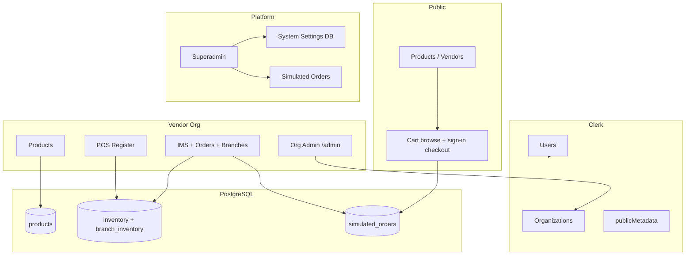

# Dilnova Commerce Hub — MVP Manual & Boundaries

Operator documentation for the Dilnova multi-vendor commerce sandbox: what the MVP includes, who can do what, how major flows work, and known limits.

**Stack:** Next.js 16 · Clerk (auth + orgs) · PostgreSQL (Drizzle) · Cloudinary (media) · Upstash (rate limits, optional in dev)

---

## Table of contents

1. [What this MVP is](#1-what-this-mvp-is)
2. [MVP boundaries](#2-mvp-boundaries)
3. [Roles & access matrix](#3-roles--access-matrix)
4. [Role runbooks](#4-role-runbooks)
5. [Vendor phase checklists (in-app)](#5-vendor-phase-checklists-in-app)
6. [Core business rules](#6-core-business-rules)
7. [Technical setup](#7-technical-setup)
8. [Architecture](#8-architecture)
9. [Limitation board](#9-limitation-board-decision-log)
10. [Go-live checklist](#10-go-live-checklist)
11. [Glossary](#11-glossary)
12. [Known gaps & follow-ups](#12-known-gaps--follow-ups)

---

## 1. What this MVP is

Dilnova is a **multi-vendor commerce sandbox** with:

- Public **catalog** and **vendor storefronts**
- **Sign-in required** online cart and checkout (guests may browse and build a local cart)
- **Manual payment methods:** bank transfer (with payment slip upload) and cash on delivery (COD)
- **Org-scoped** vendor console (products, profile, checkout options)
- **Premium IMS** (inventory, suppliers, branches, online orders, POS) — license-gated per org
- **Superadmin** platform console (catalog, settings, orders, licenses)

This is an **MVP / simulation** environment. It does not process real card payments, ship packages, or compute jurisdiction-accurate tax.

---

## 2. MVP boundaries

### In scope

| Area | Included |
|------|----------|
| **Catalog** | Categories, products/services, media, stock badges, vendor pages |
| **Cart** | Guest local cart; **signed-in checkout**; price sync; fulfillment/payment options |
| **Orders** | Simulated online orders; bank transfer slip review; vendor admin verify/reject/cancel |
| **Stock** | Central inventory, branch allocation (premium), POS + online depletion |
| **RBAC** | Superadmin, org admin, org member (limited), customer portal |
| **Checkout config** | Platform catalog + per-org toggles (delivery, pickup, COD, bank transfer) |
| **POS** | Branch register, receipts, stock + availability checks (premium) |
| **IMS** | Suppliers, adjustments, movement log, multi-branch, simulated orders (premium) |
| **Emails** | Order confirmation, payment verified/rejected, cancellation (SMTP-dependent) |

### Out of scope

| Area | Not included |
|------|----------------|
| **Real payments** | Stripe/PayPal/etc. — no payment gateway integration |
| **`pay_online`** | Deprecated; removed from org settings and checkout catalog |
| **Guest checkout** | Guests cannot complete checkout without signing in |
| **Real shipping** | No carriers, labels, or tracking — flat $5 / free over $50 estimate |
| **Real tax** | Fixed 8% estimate — no per-jurisdiction tax classes |
| **Split payouts** | No per-vendor settlement in multi-vendor carts |
| **Production hardening** | No enterprise audit/compliance or multi-region WMS |
| **Mobile apps** | Web only |

---

## 3. Roles & access matrix

### Platform roles (Clerk user `publicMetadata.role`)

| Role | Access |
|------|--------|
| **admin** (superadmin) | `/superadmin` — full platform |
| **vendor** | Can create orgs when not in org context |
| **customer** | Default buyer role; `/customer` portal |

### Organization roles (Clerk org membership)

| Role | Can do | Cannot do |
|------|--------|-----------|
| **org:admin** | `/admin`, catalog/IMS, checkout options, profile, POS (all branches), delete products, verify/reject/cancel online orders | Superadmin console |
| **org:member** | Add products (`/vendor/products/add`), POS (assigned branch when multi-branch) | Inventory admin, suppliers, branches, org settings, checkout toggles, profile edits, delete products, order verify/cancel |
| **Signed-in user** | `/customer`, cart checkout, wishlist, invoices (own userId or email) | Vendor/admin consoles (unless also org member/admin) |

### Route map

| Route | Who |
|-------|-----|
| `/` | Public |
| `/products`, `/products/[id]` | Public |
| `/vendors`, `/vendors/[slug]` | Public |
| `/cart` | Public browse cart; **checkout requires sign-in** |
| `/contact` | Public |
| `/customer`, `/customer/invoice/[id]` | Signed-in user (order ownership enforced) |
| `/vendor` | Org member/admin |
| `/vendor?tab=catalog\|inventory\|storefront` | Org admin (phase checklists) |
| `/vendor/products/add` | Org member/admin |
| `/vendor/products` | Redirects → `/vendor?tab=catalog` (admin) or `/vendor` (member) |
| `/vendor/billing` | Org member/admin (billing license) |
| `/admin` | Org admin only |
| `/superadmin` | Platform superadmin only |

---

## 4. Role runbooks

### 4.1 Customer runbook (buyer)

**Goal:** Browse, add to cart, sign in, checkout, upload bank slip (if applicable), view orders.

| Step | Action |
|------|--------|
| 1 | Browse `/products` or a vendor at `/vendors/[slug]` |
| 2 | Add items to cart (blocked if out of stock, non-purchasable, or **missing inventory record**) |
| 3 | Open `/cart` — **sign in** to proceed to checkout |
| 4 | Select **fulfillment** (delivery / pickup if enabled) and **payment** (bank transfer / COD) |
| 5 | Review subtotal + 8% tax + shipping → **Proceed to Checkout** |
| 6 | View orders at `/customer`; upload bank payment slip when status is **Pending Payment** |
| 7 | Print invoice from `/customer/invoice/[id]` |

**Rules to remember:**

- Multi-vendor cart: only checkout options enabled by **all** vendors in the cart appear.
- COD cannot combine with store pickup.
- Bank transfer requires vendor bank details configured at `/admin`.
- Cart prices refresh from the server on load.
- Checkout email is bound to the signed-in user's **primary Clerk email** (server-side).
- Orders match portal by `customerUserId` **or** normalized email.

---

### 4.2 Vendor org admin runbook

**Goal:** Configure storefront, enable checkout, manage inventory, handle online orders, run POS.

#### A. Storefront & checkout (`/admin`, `/vendor?tab=storefront`)

| Step | Action |
|------|--------|
| 1 | Edit public profile: description, address, phone, banner |
| 2 | Set **stock allocation mode**: `central_intake` or `target_branch` |
| 3 | Complete **bank transfer** fields if enabling bank transfer |
| 4 | Enable **checkout options** — at least one fulfillment + one payment |
| 5 | If enabling **store pickup**, create at least one branch (Inventory or DB) |

#### B. Catalog (`/vendor?tab=catalog`)

| Step | Action |
|------|--------|
| 1 | View/delete products in catalog grid |
| 2 | Add products via `/vendor/products/add` (auto-creates inventory row for products) |
| 3 | Verify listings on `/products` and `/vendors/[slug]` |

#### C. IMS (`/vendor?tab=inventory`) — requires IMS license

| Step | Action |
|------|--------|
| 1 | Stock levels, suppliers, movement log, branches |
| 2 | **Simulated Orders** tab — verify bank transfers, fulfill COD, reject slips, cancel |
| 3 | Deep link: `/vendor?tab=inventory&imsTab=orders` |

#### D. POS (`/vendor/billing`) — requires billing license

| Step | Action |
|------|--------|
| 1 | Select branch register |
| 2 | Add products to sale |
| 3 | Complete checkout — stock depletes per branch rules |
| 4 | Print receipt |

---

### 4.3 Org member runbook (cashier / contributor)

**Goal:** Add listings and run POS at assigned branch.

| Step | Action |
|------|--------|
| 1 | Add products at `/vendor/products/add` |
| 2 | Open POS at `/vendor/billing` (billing license required) |
| 3 | Select **assigned** branch when multi-branch is enabled |
| 4 | Process sales — server enforces stock availability and branch assignment |

**Restrictions:** Cannot change inventory, org settings, checkout options, profile, delete products, or manage online orders.

---

### 4.4 Superadmin runbook (platform operator)

**Goal:** Configure platform, manage licenses, oversee orders platform-wide.

#### Console tabs (`/superadmin`)

| Tab | Purpose |
|-----|---------|
| Overview | Platform stats |
| Categories | Category tree |
| Products | Global product view |
| Inventory | IMS across orgs, simulated orders, licenses |
| Pricing | Landing pricing plans |
| Contacts | Contact submissions + vendor/customer role sync |
| Settings | Branding, checkout catalog, stock availability catalog |

#### Order operations

Superadmin **can** fulfill/cancel orders platform-wide. In normal vendor operations, **org admins** handle their org's orders on the IMS **Simulated Orders** tab.

#### License assignment (per org)

| Flag | Enables |
|------|---------|
| `ims_enabled` + expiry | IMS workspace |
| `ims_multi_branch_enabled` | Branches + branch inventory |
| `ims_billing_enabled` | POS register |

#### First-time platform bootstrap

1. Set superadmin: Clerk user `publicMetadata.role = "admin"`.
2. Run database migrations (see [Technical setup](#7-technical-setup)).
3. Sign in → `/superadmin` → set system name/logo and checkout catalog.
4. Create vendor org → assign `org:admin`.
5. Superadmin → Inventory → Licenses → enable IMS/billing for org.
6. Vendor admin → `/admin` → enable checkout options + bank details + branches (if pickup/multi-branch).

---

## 5. Vendor phase checklists (in-app)

Use these **in order** during sandbox QA. Each phase has a live checklist in the vendor console.

| Phase | Focus | Route |
|-------|-------|-------|
| **1** | Org setup (profile, bank transfer, checkout options) | `/admin` |
| **2** | Catalog listings | `/vendor?tab=catalog` |
| **3** | IMS stock, suppliers, branches | `/vendor?tab=inventory` |
| **4** | POS register | `/vendor/billing` |
| **5** | Online order lifecycle (verify/reject/COD/cancel) | `/vendor?tab=inventory&imsTab=orders` |
| **6** | Public storefront E2E (guest browse + customer checkout) | `/vendor?tab=storefront` |

**Recommended test accounts:** one `org:admin` and one `org:member` in the same org, plus a separate signed-in customer account.

---

## 6. Core business rules

### 6.1 Stock model

```
Central inventory (source of truth)
    ├── sum(branch allocations) ≤ central quantity
    ├── Restock central (+multi-branch) → default branch syncs on restock
    ├── Damage/loss central (-multi-branch) → default branch -= (capped)
    ├── Store pickup (online/POS) → central + that branch
    ├── Home delivery (online) → central + reduce branch allocations (ledger sync)
    └── POS multi-branch → central + selected branch
```

**Stock availability statuses:** In Stock, Out of Stock, Pre-Order (+ custom from superadmin catalog).

- Auto rule: `in_stock` + quantity 0 → displays as out of stock.
- **Products without an inventory row are not purchasable online** (Out of Stock badge; add-to-cart disabled).
- Online checkout and POS enforce `allowsPurchase` (services exempt).

### 6.2 Online checkout totals

| Component | Rule |
|-----------|------|
| Subtotal | Sum of line items (server-validated) |
| Tax | 8% of subtotal |
| Shipping | $5 flat; free when subtotal > $50; $0 for store pickup |
| Grand total | Subtotal + tax + shipping (stored on order) |

### 6.3 Online checkout — payment vs stock

| Payment | Initial status | Stock timing |
|---------|----------------|--------------|
| **Bank transfer** | `pending_payment` | **Reserved/depleted at checkout**; restored on cancel |
| **COD** | `pending_payment` | **Reserved/depleted at checkout**; restored on cancel |
| **Bank slip uploaded** | `payment_submitted` | Stock remains depleted until cancel |

Vendor admin **Verify Payment** (bank transfer) or **Mark COD Fulfilled** → `fulfilled`.

Vendor admin **Reject Slip** (bank transfer) → back to `pending_payment` (customer re-uploads).

### 6.4 Bank transfer workflow

```
Checkout (signed in)     → pending_payment + stock depleted
Customer uploads slip    → payment_submitted
Vendor Verify Payment   → fulfilled
Vendor Reject Slip      → pending_payment (customer can re-upload)
Vendor Cancel           → cancelled + stock restored (if depleted)
```

Bank instructions appear on order confirmation, customer portal, and invoice when vendor bank details are complete at `/admin`.

### 6.5 Checkout options resolution

```
Platform catalog (superadmin)
    → Org toggles (org admin)
        → Cart intersection (all vendors in cart must enable option)
            → Server validation at checkout
```

**Built-in options (active):**

| ID | Type | Notes |
|----|------|-------|
| `standard_delivery` | Fulfillment | Home delivery |
| `store_pickup` | Fulfillment | Requires branch; zero shipping |
| `cash_on_delivery` | Payment | `pending_payment`; delivery only |
| `bank_transfer` | Payment | `pending_payment`; requires vendor bank details |

**Deprecated:** `pay_online` — filtered from catalog and org settings.

### 6.6 Order statuses

| Status | Label | Vendor admin actions |
|--------|-------|----------------------|
| `pending` | Pending | Cancel |
| `pending_payment` | Pending Payment | Cancel; COD fulfill; await bank slip |
| `payment_submitted` | Slip Submitted | Verify payment; reject slip; cancel |
| `fulfilled` | Fulfilled | Terminal |
| `cancelled` | Cancelled | Terminal |

Active orders (`pending`, `pending_payment`, `payment_submitted`) can be cancelled by org admin.

### 6.7 Security rules

- Checkout requires sign-in; customer email bound to session primary email (server-side).
- Customer portal and invoices: ownership via `customerUserId` OR normalized email.
- Payment slip upload: same ownership rules as invoice.
- Org profile, checkout toggles: **org:admin** only.
- IMS mutations and order verify/reject/cancel: **org:admin** only.
- POS: **org:member** + **org:admin**; members scoped to assigned branches when multi-branch is active.
- POS data loader (`getVendorBillingRegisterData`) returns register-only payload for members (no suppliers, org member emails, etc.).

---

## 7. Technical setup

### 7.1 Environment variables

See `.env.example` for the full list. Minimum:

```env
NEXT_PUBLIC_CLERK_PUBLISHABLE_KEY=
CLERK_SECRET_KEY=
DATABASE_URL=postgresql://...

NEXT_PUBLIC_CLOUDINARY_CLOUD_NAME=
CLOUDINARY_API_KEY=
CLOUDINARY_API_SECRET=

# Optional — emails (order confirmation, payment verified/rejected, cart summary)
SMTP_HOST=
SMTP_PORT=
SMTP_USER=
SMTP_PASSWORD=
EMAIL_FROM_ADDRESS=
EMAIL_FROM_NAME=
NEXT_PUBLIC_APP_URL=https://yourdomain.com

# Recommended in production (rate limiting across instances)
UPSTASH_REDIS_REST_URL=
UPSTASH_REDIS_REST_TOKEN=
```

### 7.2 Install & run

```bash
pnpm install
pnpm dev      # development
pnpm build    # production build
pnpm start    # production server
pnpm test     # unit tests
pnpm tsc --noEmit
```

### 7.3 Database migrations

Run in order against your Postgres database (see `drizzle/` for current files):

```bash
# Apply all pending migrations per your Drizzle workflow, e.g.:
psql $DATABASE_URL -f drizzle/0003_checkout_fulfillment.sql
psql $DATABASE_URL -f drizzle/0004_stock_availability.sql
psql $DATABASE_URL -f drizzle/0005_checkout_totals.sql
psql $DATABASE_URL -f drizzle/0006_order_stock_depleted.sql
```

### 7.4 Key source files

| Area | Path |
|------|------|
| Cart / checkout | `app/cart/page.tsx`, `app/cart/actions.ts`, `app/context/CartContext.tsx` |
| Checkout options | `utils/checkoutOptionsShared.ts`, `utils/checkoutOptions.ts` |
| Bank transfer | `utils/bankTransfer.ts`, `utils/bankTransferServer.ts` |
| Order payment rules | `utils/orderPayment.ts`, `utils/simulatedOrderTransitions.ts` |
| Customer portal / slip | `app/(customer)/customer/`, `app/components/PaymentSlipUpload.tsx` |
| Stock / availability | `utils/stockAvailabilityShared.ts`, `utils/storefrontPurchase.ts` |
| Vendor orders | `app/(vendor)/vendor/orderActions.ts`, `VendorInventoryWorkspace.tsx` |
| Vendor IMS/POS | `app/(vendor)/vendor/products/inventoryActions.ts`, `app/(vendor)/vendor/billing/` |
| Phase checklists | `app/(admin)/admin/page.tsx`, `app/(vendor)/vendor/page.tsx`, `app/(vendor)/vendor/billing/page.tsx` |
| Schema | `db/schema.ts` |

---

## 8. Architecture



### Order lifecycle (current)

```
Bank transfer / COD checkout → pending_payment, stock_depleted=true
Bank slip upload             → payment_submitted
Vendor Verify                → fulfilled
Vendor Reject slip         → pending_payment
Vendor Cancel (active)     → cancelled, stock restored if depleted
Store pickup               → depletes central + branch
Home delivery              → depletes central + reduces branch allocations
```

---

## 9. Limitation board (decision log)

| Question | MVP answer |
|----------|------------|
| Do we process real card payments? | **No** |
| Can guests checkout without signing in? | **No** — sign in required |
| Do vendors fulfill their own online orders? | **Yes** — org admin on IMS Simulated Orders tab |
| Can COD + pickup be combined? | **No** |
| Is tax legally correct? | **No** — 8% display estimate |
| Multi-vendor cart settlement? | **No** — single order, one total |
| Real-time inventory across warehouses? | **Partial** — central + branch rules |
| Email order confirmations? | **Yes** — when SMTP is configured |
| Public API for third parties? | **No** |
| Is `pay_online` available? | **No** — deprecated |

---

## 10. Go-live checklist

Use before demo or sandbox go-live:

- [ ] Database migrations applied on target database
- [ ] Superadmin role set in Clerk (`publicMetadata.role = "admin"`)
- [ ] Checkout catalog saved in superadmin Settings
- [ ] Upstash configured for production rate limits (recommended)
- [ ] SMTP configured for order/payment emails (optional but recommended)
- [ ] Each vendor org: profile + checkout options at `/admin`
- [ ] Bank transfer fields complete if bank transfer enabled
- [ ] Branches created before enabling store pickup
- [ ] IMS and billing licenses assigned per org as needed
- [ ] **Phase 1–6** vendor checklists completed (`/admin`, `/vendor`, `/vendor/billing`)
- [ ] Guest browse test (incognito): stock gating + sign-in gate at `/cart`
- [ ] Customer checkout test: bank transfer + slip upload + vendor verify
- [ ] COD test: delivery checkout + vendor fulfill
- [ ] Member RBAC test: POS only; blocked from `/admin` and IMS
- [ ] Multi-vendor cart → only shared checkout options shown
- [ ] POS sale → central + branch stock updates correctly

---

## 11. Glossary

| Term | Meaning |
|------|---------|
| **Simulated order** | Online checkout record; not a real payment capture |
| **Central inventory** | Org-wide stock pool (`inventory` table) |
| **Branch inventory** | Per-branch allocation (`branch_inventory` table) |
| **COD** | Cash on Delivery → `pending_payment`; vendor marks fulfilled |
| **Bank transfer** | Manual payment → slip upload → vendor verifies |
| **IMS** | Inventory Management System (premium license) |
| **POS** | Point of Sale billing register (premium license) |
| **Intersection** | Cart checkout options = enabled by every vendor in cart |
| **Stock depleted flag** | `stock_depleted` on order — controls cancel stock restore |

---

## 12. Known gaps & follow-ups

Items identified in audits that are **not** fully closed:

| Item | Status |
|------|--------|
| Cart quantity not capped to available stock at UI level | Open — fails at checkout |
| `syncCartPrices` does not remove non-purchasable/out-of-stock items | Open |
| Vendor stock-availability edit UI | Partial — server action exists, IMS UI not fully wired |
| Unassigned multi-branch member sees all branches on Add Item | Open — server rejects; UX confusing |
| Premium license cache (~5 min) | By design — revocation may lag briefly |
| Automated vendor/customer RBAC integration tests | Open |
| Multi-vendor order vendor subtotals display | Partial |
| Real payment gateway integration | Out of scope |
| Fulfilled → cancelled edge cases | Partial |

**Recently addressed (for reference):**

- P0: products without inventory rows no longer appear purchasable (`resolveOnlineProductPurchaseState`)
- POS member data scope tightened (`getVendorBillingRegisterData`)
- In-app vendor phase checklists (Phases 1–6)

---

*Last updated: June 2026 — sign-in checkout, bank transfer slip flow, vendor order ops, phase checklists, inventory purchasability fix.*
