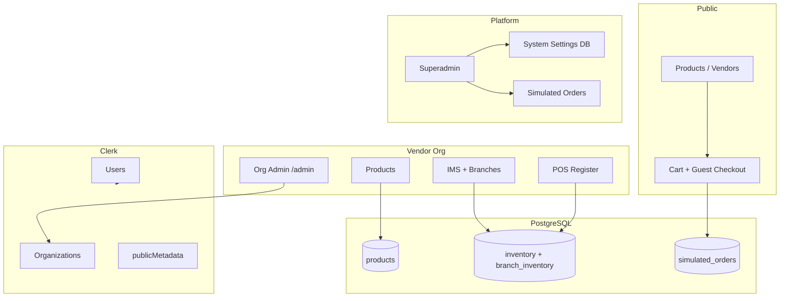

# Dilnova Commerce Hub — MVP Manual & Boundaries

Operator documentation for the Dilnova multi-vendor commerce sandbox: what the MVP includes, who can do what, how major flows work, and known limits.

**Stack:** Next.js 16 · Clerk (auth + orgs) · PostgreSQL (Drizzle) · Cloudinary (media)

---

## Table of contents

1. [What this MVP is](#1-what-this-mvp-is)
2. [MVP boundaries](#2-mvp-boundaries)
3. [Roles & access matrix](#3-roles--access-matrix)
4. [Role runbooks](#4-role-runbooks)
5. [Core business rules](#5-core-business-rules)
6. [Technical setup](#6-technical-setup)
7. [Architecture](#7-architecture)
8. [Limitation board](#8-limitation-board-decision-log)
9. [Go-live checklist](#9-go-live-checklist)
10. [Glossary](#10-glossary)
11. [Known gaps & follow-ups](#11-known-gaps--follow-ups)

---

## 1. What this MVP is

Dilnova is a **multi-vendor commerce sandbox** with:

- Public **catalog** and **vendor storefronts**
- **Guest + signed-in** online cart and simulated checkout
- **Org-scoped** vendor console (products, profile, checkout options)
- **Premium IMS** (inventory, suppliers, branches, POS) — license-gated per org
- **Superadmin** platform console (catalog, settings, orders, licenses)

This is an **MVP / simulation** environment. It does not process real payments, ship packages, or compute jurisdiction-accurate tax.

---

## 2. MVP boundaries

### In scope

| Area | Included |
|------|----------|
| **Catalog** | Categories, products/services, media, stock badges, vendor pages |
| **Cart** | Guest checkout, signed-in checkout, price sync, fulfillment/payment options |
| **Orders** | Simulated online orders, COD hold-until-fulfill, superadmin fulfill/cancel |
| **Stock** | Central inventory, branch allocation (premium), POS + online depletion rules |
| **RBAC** | Superadmin, org admin, org member (limited), customer portal |
| **Checkout config** | Platform catalog + per-org toggles (delivery, pickup, COD, pay online) |
| **POS** | Branch register, receipts, stock + availability checks (premium) |
| **IMS** | Suppliers, adjustments, movement log, multi-branch (premium) |

### Out of scope

| Area | Not included |
|------|----------------|
| **Real payments** | Stripe/PayPal/etc. — “Pay Online” is simulated only |
| **Real shipping** | No carriers, labels, or tracking — flat $5 / free over $50 estimate |
| **Real tax** | Fixed 8% estimate — no per-jurisdiction tax classes |
| **Order emails** | No automatic order confirmation email on checkout |
| **Vendor order ops** | Vendors **view** orders; only **superadmin** fulfills/cancels |
| **Split payouts** | No per-vendor settlement in multi-vendor carts |
| **Production hardening** | No enterprise audit/compliance or multi-region WMS |
| **Mobile apps** | Web only |
| **Guest order portal** | Guests checkout by email; portal requires sign-in with matching email |

---

## 3. Roles & access matrix

### Platform roles (Clerk user `publicMetadata.role`)

| Role | Access |
|------|--------|
| **admin** (superadmin) | `/superadmin` — full platform |
| **vendor** | Can create orgs when not in org context |
| **customer** | Default buyer role; `/customer` portal |

### Organization roles (Clerk org membership)

| Role | Can do | Cannot do |
|------|--------|-----------|
| **org:admin** | `/admin`, catalog/IMS, checkout options, profile, POS (all branches), delete products | Superadmin console |
| **org:member** | Add products (`/vendor/products/add`), POS (assigned branch), view `/vendor` dashboard | Inventory admin, suppliers, branches, org settings, checkout toggles, profile edits, delete products |
| **Signed-in customer** | `/customer`, cart, wishlist, invoices (own email) | Vendor/admin consoles |

### Route map

| Route | Who |
|-------|-----|
| `/` | Public |
| `/products`, `/products/[id]` | Public |
| `/vendors`, `/vendors/[slug]` | Public |
| `/cart` | Public (guest + signed-in) |
| `/contact` | Public |
| `/customer`, `/customer/invoice/[id]` | Signed-in customer |
| `/vendor` | Org member/admin |
| `/vendor/products/add` | Org member/admin |
| `/vendor/products` | Org admin (IMS license) |
| `/vendor/billing` | Org member/admin (billing license) |
| `/admin` | Org admin only |
| `/superadmin` | Platform superadmin only |

---

## 4. Role runbooks

### 4.1 Customer runbook (buyer)

**Goal:** Browse, add to cart, checkout, view orders.

| Step | Action |
|------|--------|
| 1 | Browse `/products` or a vendor at `/vendors/[slug]` |
| 2 | Add items to cart (blocked if out of stock or non-purchasable) |
| 3 | Open `/cart` — guest enters name + email; signed-in uses session primary email |
| 4 | Select **fulfillment** (delivery / pickup if enabled) and **payment** |
| 5 | Review subtotal + 8% tax + shipping → **Proceed to Checkout** |
| 6 | Signed-in users view orders at `/customer`; print invoice from order detail |

**Rules to remember:**

- Multi-vendor cart: only checkout options enabled by **all** vendors in the cart appear.
- Cash on Delivery (COD) cannot combine with store pickup.
- Cart prices refresh from the server on load.
- Guest orders are not visible in the portal until the user signs in with the **same email** used at checkout.

---

### 4.2 Vendor org admin runbook

**Goal:** Configure storefront, enable checkout, manage inventory and POS.

#### A. Storefront & checkout (`/admin`, `/vendor`)

| Step | Action |
|------|--------|
| 1 | Edit public profile: description, address, phone, banner |
| 2 | Set **stock allocation mode**: `central_intake` or `target_branch` |
| 3 | Enable **checkout options** — requires at least one fulfillment + one payment |
| 4 | If enabling **store pickup**, create at least one branch first |

#### B. Catalog & IMS (`/vendor/products`) — requires IMS license

| Step | Action |
|------|--------|
| 1 | View central inventory, suppliers, branches, movement log |
| 2 | Restock central stock (multi-branch: default branch syncs on restock) |
| 3 | Allocate branch stock (cannot exceed unallocated central pool) |
| 4 | Create branches and assign cashiers (org members only) |
| 5 | Add/delete products; set stock availability at product create |

#### C. POS (`/vendor/billing`) — requires billing license

| Step | Action |
|------|--------|
| 1 | Select branch register |
| 2 | Add products to sale |
| 3 | Complete checkout — stock depletes per branch rules |
| 4 | Print receipt |

---

### 4.3 Org member runbook (cashier / contributor)

**Goal:** Add listings and run POS at assigned branch.

| Step | Action |
|------|--------|
| 1 | Add products at `/vendor/products/add` |
| 2 | Open POS at `/vendor/billing` (billing license required) |
| 3 | Select assigned branch when multi-branch is enabled |
| 4 | Process sales — server enforces stock availability and active product status |

**Restrictions:** Cannot change inventory, org settings, checkout options, profile, or delete products.

---

### 4.4 Superadmin runbook (platform operator)

**Goal:** Configure platform, manage licenses, fulfill online orders.

#### Console tabs (`/superadmin`)

| Tab | Purpose |
|-----|---------|
| Overview | Platform stats |
| Categories | Category tree |
| Products | Global product view |
| Inventory | IMS across orgs, simulated orders (fulfill/cancel), licenses |
| Pricing | Landing pricing plans |
| Contacts | Contact submissions + vendor/customer role sync |
| Settings | Branding, checkout catalog, stock availability catalog |

#### Order fulfillment workflow

```
Pay online order  → status: pending, stock already depleted
                  → Fulfill (status) or Cancel (restore stock)

COD order         → status: pending_payment, stock NOT depleted yet
                  → Fulfill (depletes stock) or Cancel (no stock restore)
```

#### License assignment (per org)

| Flag | Enables |
|------|---------|
| `ims_enabled` + expiry | IMS workspace |
| `ims_multi_branch_enabled` | Branches + branch inventory |
| `ims_billing_enabled` | POS register |

#### First-time platform bootstrap

1. Set superadmin: Clerk user `publicMetadata.role = "admin"`.
2. Run database migrations (see [Technical setup](#6-technical-setup)).
3. Sign in → `/superadmin` → set system name/logo and checkout catalog.
4. Create vendor org → assign `org:admin`.
5. Superadmin → Inventory → Licenses → enable IMS/billing for org.
6. Vendor admin → `/admin` → enable checkout options + add branches (if multi-branch).

---

## 5. Core business rules

### 5.1 Stock model

```
Central inventory (source of truth)
    ├── sum(branch allocations) ≤ central quantity
    ├── Restock central (+multi-branch) → default branch += same delta
    ├── Damage/loss central (-multi-branch) → default branch -= (capped)
    ├── Store pickup (online/POS) → central + that branch
    ├── Home delivery (online) → central + reduce branch allocations (ledger sync)
    └── POS multi-branch → central + selected branch
```

**Stock availability statuses:** In Stock, Out of Stock, Pre-Order (+ custom from superadmin catalog).

- Auto rule: `in_stock` + quantity 0 → displays as out of stock.
- Online checkout and POS enforce `allowsPurchase` (services exempt).

### 5.2 Online checkout totals

| Component | Rule |
|-----------|------|
| Subtotal | Sum of line items (server-validated) |
| Tax | 8% of subtotal |
| Shipping | $5 flat; free when subtotal > $50; $0 for store pickup |
| Grand total | Subtotal + tax + shipping (stored on order) |

### 5.3 Online checkout — payment vs stock

| Payment | Order status | Stock timing |
|---------|--------------|--------------|
| Pay online | `pending` | Depleted at checkout |
| COD | `pending_payment` | Held until superadmin **Fulfill** |

### 5.4 Checkout options resolution

```
Platform catalog (superadmin)
    → Org toggles (org admin)
        → Cart intersection (all vendors in cart must enable option)
            → Server validation at checkout
```

**Built-in options:**

| ID | Type | Notes |
|----|------|-------|
| `standard_delivery` | Fulfillment | Home delivery |
| `store_pickup` | Fulfillment | Requires branch; zero shipping |
| `cash_on_delivery` | Payment | `pending_payment`; delivery only |
| `pay_online` | Payment | Simulated payment |

### 5.5 Order statuses

| Status | Label | Active (fulfill/cancel)? |
|--------|-------|--------------------------|
| `pending` | Pending | Yes |
| `pending_payment` | Pending Payment (COD) | Yes |
| `fulfilled` | Fulfilled | No |
| `cancelled` | Cancelled | No |

### 5.6 Security rules (Phase 1)

- Signed-in checkout binds to session **primary email** (server-side).
- Customer portal and invoices use normalized, case-insensitive email lookup.
- Org profile, checkout toggles, and stock-availability updates: **org:admin** only.
- POS and read-only inventory data: **org:member** allowed where noted.
- Branch member assignment verifies target user is in the org.

---

## 6. Technical setup

### 6.1 Environment variables

```env
NEXT_PUBLIC_CLERK_PUBLISHABLE_KEY=
CLERK_SECRET_KEY=
DATABASE_URL=postgresql://...
NEXT_PUBLIC_CLOUDINARY_CLOUD_NAME=
CLOUDINARY_API_KEY=
CLOUDINARY_API_SECRET=

# Optional — cart summary email only
SMTP_HOST=
SMTP_PORT=
SMTP_USER=
SMTP_PASSWORD=
EMAIL_FROM_ADDRESS=
EMAIL_FROM_NAME=
```

### 6.2 Install & run

```bash
cd dilnova
npm install
npm run dev      # development
npm run build    # production build
npm start        # production server
```

### 6.3 Database migrations

Run in order against your Postgres database:

| File | Purpose |
|------|---------|
| `drizzle/0000_solid_skrulls.sql` | Base schema |
| `drizzle/0001_brief_scalphunter.sql` | Schema update |
| `drizzle/0002_absent_warpath.sql` | Schema update |
| `drizzle/0003_checkout_fulfillment.sql` | Fulfillment/payment on orders |
| `drizzle/0004_stock_availability.sql` | Per-SKU availability |
| `drizzle/0005_checkout_totals.sql` | Subtotal/tax/shipping breakdown |
| `drizzle/0006_order_stock_depleted.sql` | COD stock hold flag |

```bash
psql $DATABASE_URL -f drizzle/0003_checkout_fulfillment.sql
psql $DATABASE_URL -f drizzle/0004_stock_availability.sql
psql $DATABASE_URL -f drizzle/0005_checkout_totals.sql
psql $DATABASE_URL -f drizzle/0006_order_stock_depleted.sql
```

### 6.4 Key source files

| Area | Path |
|------|------|
| Cart | `app/cart/page.tsx`, `app/cart/actions.ts`, `app/context/CartContext.tsx` |
| Checkout options | `utils/checkoutOptionsShared.ts`, `utils/checkoutOptions.ts` |
| Totals | `utils/checkoutTotals.ts` |
| Email/security | `utils/customerEmail.ts` |
| Stock | `utils/inventoryStock.ts`, `utils/stockLedger.ts`, `utils/onlineOrderStock.ts` |
| Stock availability | `utils/stockAvailabilityShared.ts`, `utils/stockAvailability.ts` |
| Orders | `utils/orderStatus.ts`, `app/(superadmin)/superadmin/inventoryActions.ts` |
| Vendor IMS/POS | `app/(vendor)/vendor/products/inventoryActions.ts`, `app/(vendor)/vendor/billing/POSBillingClient.tsx` |
| Schema | `db/schema.ts` |

---

## 7. Architecture



### Order lifecycle

```
Pay online  → pending, stock_depleted=true  → Fulfill / Cancel (restore stock)
COD         → pending_payment, stock_depleted=false → Fulfill (deplete) / Cancel (no restore)
Store pickup → depletes central + branch
Home delivery → depletes central + reduces branch allocations (default first)
```

---

## 8. Limitation board (decision log)

Use this table as the **border** when scoping new work:

| Question | MVP answer |
|----------|------------|
| Do we process real card payments? | **No** — simulated |
| Do vendors fulfill their own online orders? | **No** — superadmin only |
| Can COD + pickup be combined? | **No** |
| Is tax legally correct? | **No** — 8% display estimate |
| Can guests track orders without login? | **No** — sign in with same email |
| Multi-vendor cart settlement? | **No** — single order, one total |
| Real-time inventory across warehouses? | **Partial** — central + branch rules |
| Email order confirmations? | **No** |
| Public API for third parties? | **No** |

---

## 9. Go-live checklist

Use before demo or sandbox go-live:

- [ ] Migrations `0003`–`0006` applied on target database
- [ ] Superadmin role set in Clerk (`publicMetadata.role = "admin"`)
- [ ] Checkout catalog saved in superadmin Settings
- [ ] Each vendor org: checkout options enabled (delivery + pay online minimum)
- [ ] Branches created before enabling store pickup
- [ ] IMS and billing licenses assigned per org as needed
- [ ] Test guest checkout → sign up with same email → order visible in `/customer`
- [ ] Test COD order → superadmin Fulfill → stock depletes
- [ ] Test multi-vendor cart → only shared checkout options shown
- [ ] Test POS sale → central + branch stock updates correctly

---

## 10. Glossary

| Term | Meaning |
|------|---------|
| **Simulated order** | Online checkout record; not a real payment capture |
| **Central inventory** | Org-wide stock pool (`inventory` table) |
| **Branch inventory** | Per-branch allocation (`branch_inventory` table) |
| **COD** | Cash on Delivery → `pending_payment`; stock depletes on fulfill |
| **IMS** | Inventory Management System (premium license) |
| **POS** | Point of Sale billing register (premium license) |
| **Intersection** | Cart checkout options = enabled by every vendor in cart |
| **Stock depleted flag** | `stock_depleted` on order — controls cancel stock restore |

---

## 11. Known gaps & follow-ups

Items identified in audits that are **not** part of the current MVP:

| Item | Status |
|------|--------|
| Multi-vendor order vendor subtotals | Open |
| Order confirmation email on checkout | Open |
| Tax classes in DB (unused) | Open |
| Vendor stock-availability edit UI | Partial — server exists, UI not fully wired |
| `getVendorInventoryData` read scope for org:member | Over-exposes — tighten if needed |
| Fulfilled → cancelled edge cases | Partial |
| Real payment gateway integration | Out of scope |
| 5-minute caches (org checkout options, premium status) | By design for MVP |

---

*Last updated: reflects Phase 1 (security), Phase 2 (commerce correctness), and Phase 3 (stock ledger + POS + COD hold) implementation.*
