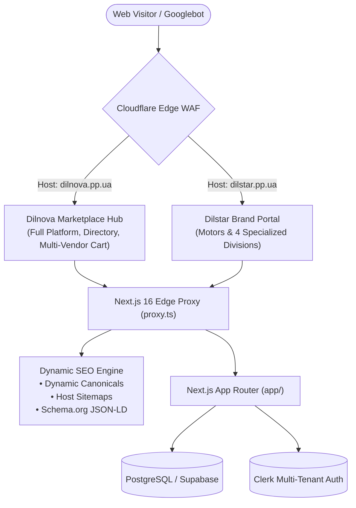

# Multi-Domain & SEO Architecture Specification — Dilnova Commerce Hub

**Platform:** Dilnova Commerce Hub  
**Flagship Brand:** Distar Industries (Motors & Hardware)  
**Primary Platform Domain:** `dilnova.pp.ua`  
**Flagship Brand Domain:** `dilstar.pp.ua`  
**Architecture Style:** Multi-Tenant Host Rewriting with Dynamic SEO Isolation

---

## 1. System Overview

Dilnova Commerce Hub is architected to support dual-domain operations from a single unified Next.js 16 deployment:



---

## 2. Domain & Routing Matrix

### A. `dilnova.pp.ua` — Marketplace Platform Hub

Serves the complete multi-vendor marketplace, third-party sellers, vendor admin console, customer dashboard, and platform billing.

| Route on `dilnova.pp.ua`                   | Component / Purpose                       | Notes                                                          |
| :----------------------------------------- | :---------------------------------------- | :------------------------------------------------------------- |
| `https://www.dilnova.pp.ua/`               | Marketplace Homepage (`app/page.tsx`)     | 3D Hero, Featured Stores, Independent Sellers, Pricing plans   |
| `https://www.dilnova.pp.ua/vendors`        | Vendor Directory (`app/vendors/page.tsx`) | Browse all registered sellers                                  |
| `https://www.dilnova.pp.ua/vendors/[slug]` | Vendor Storefronts                        | Dynamic vendor stores (`distar-hardware`, `distar-tech`, etc.) |
| `https://www.dilnova.pp.ua/products`       | Global Catalog                            | Search across all marketplace products                         |
| `https://www.dilnova.pp.ua/cart`           | Unified Shopping Cart                     | Cross-vendor shared cart                                       |
| `https://www.dilnova.pp.ua/admin`          | Org Admin Console                         | Catalog and order management                                   |
| `https://www.dilnova.pp.ua/superadmin`     | Platform Superadmin                       | System-level governance and settings                           |

---

### B. `dilstar.pp.ua` — Flagship Brand Portal

Dedicated showcase for the **Distar** brand, highlighting **Industrial Motors & Heavy Hardware** alongside its 4 specialized divisions.

| Brand URL on `dilstar.pp.ua`              | Underlying Next.js Route                        | Description                                                                  |
| :---------------------------------------- | :---------------------------------------------- | :--------------------------------------------------------------------------- |
| `https://www.dilstar.pp.ua/`              | `/brand/dilstar` (`app/brand/dilstar/page.tsx`) | Flagship Motors Hero, Division cards, Featured products                      |
| `https://www.dilstar.pp.ua/hardware`      | `/vendors/distar-hardware`                      | **Distar Hardware & Motors** (3-phase induction motors, contractor tools)    |
| `https://www.dilstar.pp.ua/tech`          | `/vendors/distar-tech`                          | **Distar Tech Store** (Developer workstations, GPU rigs, servers)            |
| `https://www.dilstar.pp.ua/nursery`       | `/vendors/distar-nursery`                       | **Distar Nursery** (Botanical flora, seeds, hydroponics)                     |
| `https://www.dilstar.pp.ua/services`      | `/vendors/dilstar-services`                     | **Dilstar Services** (Enterprise consulting, motor maintenance, technicians) |
| `https://www.dilstar.pp.ua/products/[id]` | `/products/[id]`                                | Direct product detail and ordering                                           |
| `https://www.dilstar.pp.ua/cart`          | `/cart`                                         | Direct checkout and cart                                                     |

---

## 3. Edge Proxy Rewrite Implementation (`proxy.ts`)

Host detection and transparent edge rewrites are handled in `proxy.ts`:

```typescript
// proxy.ts (inside clerkMiddleware handler)
const host = req.headers.get("x-forwarded-host") || req.headers.get("host") || "";
const isDilstarDomain = host.includes("dilstar.pp.ua");

const brandRouteMap: Record<string, string> = {
  "/": "/brand/dilstar",
  "/hardware": "/vendors/distar-hardware",
  "/tech": "/vendors/distar-tech",
  "/nursery": "/vendors/distar-nursery",
  "/services": "/vendors/dilstar-services",
};

const normalizedPath = req.nextUrl.pathname.replace(/\/$/, "") || "/";
let rewrittenUrl: URL | null = null;

if (isDilstarDomain && brandRouteMap[normalizedPath]) {
  rewrittenUrl = req.nextUrl.clone();
  rewrittenUrl.pathname = brandRouteMap[normalizedPath];
}
```

---

## 4. Technical SEO Architecture

### 1. Dynamic Canonical URLs (Duplicate Content Prevention)

Both domains serve specialized views. To prevent Google duplicate-content penalties, canonical URLs resolve dynamically to the host domain currently being accessed:

- Visiting `https://www.dilstar.pp.ua/hardware` yields `<link rel="canonical" href="https://www.dilstar.pp.ua/hardware" />`.
- Visiting `https://www.dilnova.pp.ua/vendors/distar-hardware` yields `<link rel="canonical" href="https://www.dilnova.pp.ua/vendors/distar-hardware" />`.

### 2. Domain-Specific XML Sitemaps (`sitemap.xml`)

The `app/sitemap.ts` generator inspects the incoming `Host` header:

- **`https://www.dilstar.pp.ua/sitemap.xml`**: Indexes the Brand Hub (`/`), the 4 division routes (`/hardware`, `/tech`, `/nursery`, `/services`), legal pages, and all Distar brand products.
- **`https://www.dilnova.pp.ua/sitemap.xml`**: Indexes the Marketplace Home, All Vendors directory (`/vendors`), all vendor slugs, categories, legal pages, and all marketplace products.

### 3. Robots.txt (`robots.ts`)

Dynamically references the correct domain-specific sitemap:

- `dilstar.pp.ua/robots.txt` → `Sitemap: https://www.dilstar.pp.ua/sitemap.xml`
- `dilnova.pp.ua/robots.txt` → `Sitemap: https://www.dilnova.pp.ua/sitemap.xml`

### 4. Schema.org Structured Data (JSON-LD)

- **Brand Schema (`@type: "Brand"`)**: Injected into `app/brand/dilstar/page.tsx` with manufacturer details, brand name `"Distar"`, and links to divisions.
- **Product Schema (`@type: "Product"`)**: Injected on product pages (`/products/[id]`) with price, currency, availability, and brand attribution for Google Rich Snippets.

### 5. Google Search Console Configuration

Both domains are independently verified via Cloudflare DNS TXT records:

- **Property 1 (`dilstar.pp.ua`):** TXT `google-site-verification=5FxqU...` → Submit `https://www.dilstar.pp.ua/sitemap.xml` (Monitors industrial hardware, motor, and tech rankings).
- **Property 2 (`dilnova.pp.ua`):** TXT `google-site-verification=4qguS...` → Submit `https://www.dilnova.pp.ua/sitemap.xml` (Monitors marketplace, vendor directory, and platform rankings).

---

## 5. Security, CSP & Authentication

### 1. Cross-Site Request Forgery (CSRF)

In `proxy.ts`, CSRF protection checks `originUrl.host === host`. Because both domains make requests to their respective hostnames, mutating server actions work seamlessly without cross-origin friction.

### 2. Content Security Policy (CSP)

Allowed Clerk origins include both:

- `https://clerk.dilnova.pp.ua`
- `https://clerk.dilstar.pp.ua`

### 3. Edge Rate Limiter

Upstash sliding-window rate limiting in `proxy.ts` keys on `cf-connecting-ip` to protect both domains uniformly against volumetric abuse.

---

## 6. DNS Configuration Reference (Cloudflare)

### Zone 1: `dilnova.pp.ua` (Platform Zone)

```bind
;; Web Routing (Proxied)
dilnova.pp.ua.       1  IN  CNAME  59fd396d57dcd238.vercel-dns-017.com. ; cf_tags=cf-proxied:true
www.dilnova.pp.ua.   1  IN  CNAME  59fd396d57dcd238.vercel-dns-017.com. ; cf_tags=cf-proxied:true

;; Clerk Authentication (DNS Only)
clerk.dilnova.pp.ua. 1  IN  CNAME  frontend-api.clerk.services.         ; cf_tags=cf-proxied:false

;; Verification
dilnova.pp.ua.    3600  IN  TXT    "google-site-verification=4qguSJSe6Rou2Hgi8J_efw04bCUoCU91iU6OVUUbY6E"
```

### Zone 2: `dilstar.pp.ua` (Brand Zone)

```bind
;; Web Routing (Proxied)
dilstar.pp.ua.       1  IN  CNAME  59fd396d57dcd238.vercel-dns-017.com. ; cf_tags=cf-proxied:true
www.dilstar.pp.ua.   1  IN  CNAME  59fd396d57dcd238.vercel-dns-017.com. ; cf_tags=cf-proxied:true

;; Direct Email & Clerk Auth
mail.dilstar.pp.ua.  1  IN  A      135.181.41.169                       ; cf_tags=cf-proxied:false
clerk.dilstar.pp.ua. 1  IN  CNAME  frontend-api.clerk.services.         ; cf_tags=cf-proxied:false

;; Verification & Email Authentication (SPF, DKIM, DMARC)
dilstar.pp.ua.    3600  IN  TXT    "google-site-verification=5FxqUvMjgXE_YKX7bg-Qmb3sOxh90QpbbIPZCZC3SnM"
dilstar.pp.ua.       1  IN  TXT    "v=spf1 include:spf.sendinblue.com include:mx.cloudflare.net ~all"
_dmarc.dilstar.pp.ua. 1 IN  TXT    "v=DMARC1; p=quarantine; pct=100; rua=mailto:rua@dmarc.brevo.com;"
```
